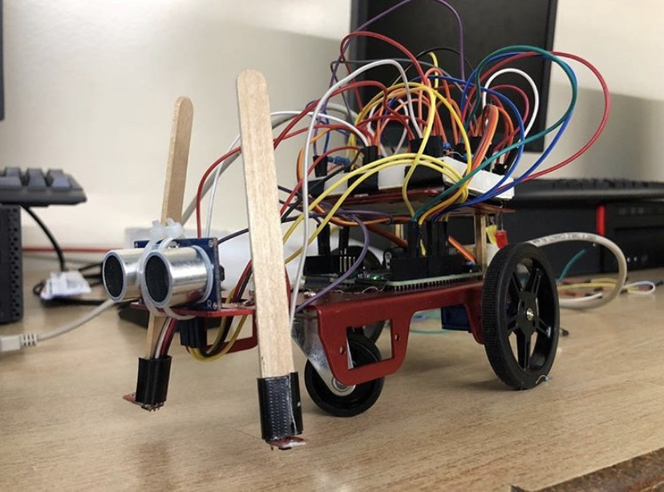

# LineFollowingRobot

Computer Engineering Project
- Design and Build a Robot that follows a black line

Constraints
- Wheels of robot must stay on opposite sides of thr black line at all times
- Robot must brake/stop when it detects an object within 20cm front its front (demoed with green plastic in Robot_Vid)

Materials:
- Arduino Uno
- Ultrasonic Sensor
- Servos
- QTR Sensors
- Chassis

**Grade: 100%**
