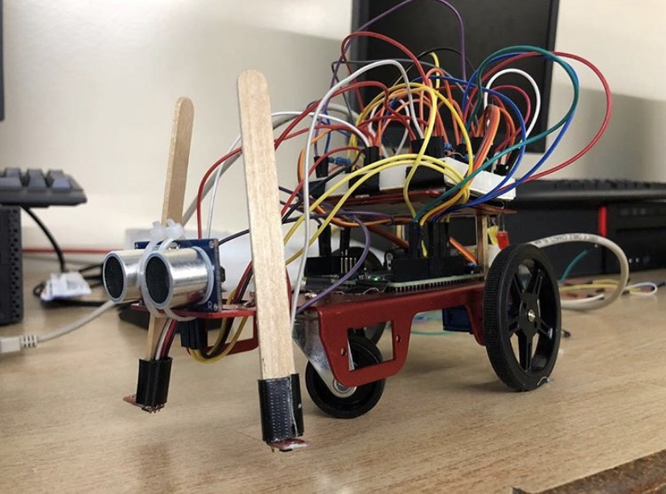

# Line Following Robot

Exploring self-driving with Arduino and C++

Course: Computer Engineering TEJ4M  
Date: April 3rd, 2019 (Grade 12)

<!--   -->

## Table of Contents
[1. Project Information](#Project-Information)  
[2. Materials](#Materials)  
[3. Design Process](#Design-Process)  
[4. Software](#Software)  
[5. Results](#Results)  
[6. Next Steps](#Next-Steps)  

## Project Information

Grade 12 computer engineering project to design and build a robot that follows a black line.

### Objectives
- Robot wheels must always stay on opposite sides of the black line
- Robot must brake/stop when it detects an object within 20cm from its front edge

## Materials
- Arduino Uno Microcontroller
- Ultrasonic Sensor
- Servos Motors
- QTR Sensor
- Metal Chassis

## Design Process
Our first step was to test the individual components to understand how they worked and explore the various types and ranges of readings we should look for while using them.

For example: A QTR sensor measures the reflectiveness of a surface with a value from 0 to 1000 (0 for white (most reflective), and 1000 for black (least reflective).
Using these measurements, we were able to develop unit test programs using Arduino and C++ for each sensor.

After each component was thoroughly tested, we proceeded to mount them on the metal chassis and wire them with one another.

## Software
### Arduino_Robot_Code.ino
Next was to integrate our individual component programs into a final program to be used by the robot. 

One thing we kept in mind during the development of this final self-driving algorithm was its time-critical aspect. As this is a real-time system, we wanted to make sure decisions were performed quickly and efficiently. The faster our robot can make its movement decisions, the overall better it will be.

Therefore, we avoided any types of algorithms with long runtimes, large space complexities, and advanced data structures (also because they weren’t needed for this application). This process mainly came down to adding if/else statements to each component's program to decide which movement decision would be made based on the current information being seen through the sensors. 

For example, if our left QTR sensor reading suddenly became very high (between 800 and 1000) we knew this means the robot has just detected the black line and is possibly drifting too far to the right. In this case, our algorithm would speed up the right servo motor, turning the robot left, until both QTR sensors were seeing white (0 to 200) again.

The main challenge of this development process was tuning the parameters to the correct sensing amounts to trigger movements. Occasionally, our QTR sensors would read 100 for a white surface one day, but 300 (outside of our range) on the next. To combat this issue, we recalibrated our sensors and re-tuned our parameters each day we came into class. These ambiguities could have been avoidable with more accurate and sophisticated sensors.

## Results

On our final day of testing, our robot was able to successfully complete all 5 paths for a **grade of 100%**. [Video here!](https://imgur.com/a/wtMLOxQ)

It was extremely cool to see this success from our hard work - we built our very own Tesla!

## Next Steps
Some fun things I would like to build on or explore relating to this project would be:
- Attempting to follow much more jagged, colorful (instead of black/white) and complicated paths
- Incorporate more sensors to generate higher amounts of data for movement decisions
- Explore the effects and efficiencies for various positions of each sensor on the chassis
- Build a more sophisticated self-driving algorithm
